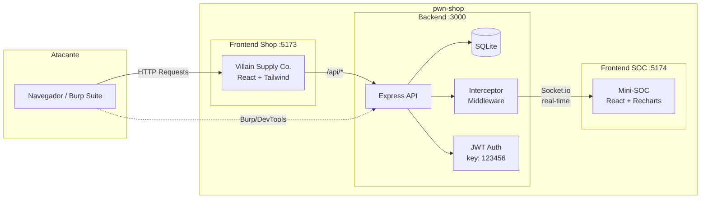

# pwn-shop


**Un Cyber Range de doble interfaz para aprender pentesting y bug bounty desde cero.**

pwn-shop es un entorno de entrenamiento compuesto por una tienda de e-commerce intencionalmente vulnerable ("Villain Supply Co." - suministros para supervillanos) y un Mini-SOC gamificado que monitorea los ataques en tiempo real.

## Arquitectura



## Vulnerabilidades (CTF)

| # | Reto | Tipo | Dificultad | Descripcion |
|---|------|------|-----------|-------------|
| 1 | Carrito Gratis | Business Logic | Easy | El servidor confía en el precio enviado por el cliente |
| 2 | XSS del Esbirro | Stored XSS | Medium | Las reseñas se renderizan sin sanitizar |
| 3 | Planos Secretos | IDOR | Easy | Los pedidos no verifican propiedad |
| 4 | Bypass de Pago | Auth Bypass | Medium | El pago acepta `{"status":"success"}` sin verificar |
| 5 | JWT Debil | Crypto | Hard | La clave de firma JWT es `123456` (fuerza bruta offline) |

Cada vulnerabilidad tiene un sistema de pistas de 2 niveles (teorica y tecnica) accesible desde el Mini-SOC.

## Quick Start

### Con Docker (recomendado)

```bash
git clone https://github.com/tu-usuario/pwn-shop.git
cd pwn-shop
docker compose up --build
```

### Instalacion local

```bash
git clone https://github.com/tu-usuario/pwn-shop.git
cd pwn-shop

# Instalar dependencias de los 3 servicios
npm run install:all

# Sembrar la base de datos
npm run seed

# Arrancar todo (backend + shop + soc)
npm run dev
```

### Acceso

| Servicio | URL | Descripcion |
|----------|-----|-------------|
| Tienda | http://localhost:5173 | E-commerce vulnerable |
| Mini-SOC | http://localhost:5174 | Panel de monitoreo + CTF |
| API | http://localhost:3000 | Backend REST |

## Como jugar

1. Abre la **Tienda** (`:5173`) y el **Mini-SOC** (`:5174`) en dos pestanas
2. Inicia sesion en la tienda con una cuenta de prueba (hay un boton para verlas)
3. Navega por la tienda — veras el trafico aparecer en la consola del SOC en tiempo real
4. Intenta explotar las vulnerabilidades usando las DevTools del navegador o Burp Suite
5. Cuando obtengas una flag (`FLAG{...}`), introducela en el SOC para desbloquear la medalla
6. Usa el sistema de pistas si te atascas (nivel 1 = teoria, nivel 2 = tecnica)
7. Si rompes la base de datos, usa el **Boton de Panico** en el SOC para resetear

## Stack

- **Backend**: Node.js + Express + SQLite (better-sqlite3) + Socket.io + JWT
- **Frontend Shop**: React 19 + Vite + Tailwind CSS 4
- **Frontend SOC**: React 19 + Vite + Tailwind CSS 4 + Recharts + Canvas Confetti
- **Monorepo**: Concurrently para desarrollo, Docker Compose para produccion

## Estructura del proyecto

```
pwn-shop/
├── backend/
│   ├── src/
│   │   ├── db/           # init.js, seed.js
│   │   ├── middleware/    # socInterceptor.js, authJwt.js
│   │   └── routes/       # auth, products, cart, reviews, orders, payment, ctf, system
│   └── Dockerfile
├── frontend-shop/
│   ├── src/
│   │   ├── components/   # Layout
│   │   ├── context/      # AuthContext, CartContext
│   │   └── pages/        # Catalog, ProductDetail, Cart, Orders, Login
│   └── Dockerfile
├── frontend-soc/
│   ├── src/
│   │   ├── components/   # LogConsole, TrafficCharts, ChallengePanel, FlagInput, StatsBar, PanicButton
│   │   └── hooks/        # useSocket, useCtf, useAlertSound
│   └── Dockerfile
├── docker-compose.yml
└── README.md
```

## Aviso legal

Este proyecto es exclusivamente educativo. Todas las vulnerabilidades son intencionales y estan documentadas. No uses estas tecnicas en sistemas sin autorizacion explicita. Practica siempre en entornos controlados.

## Licencia

MIT
